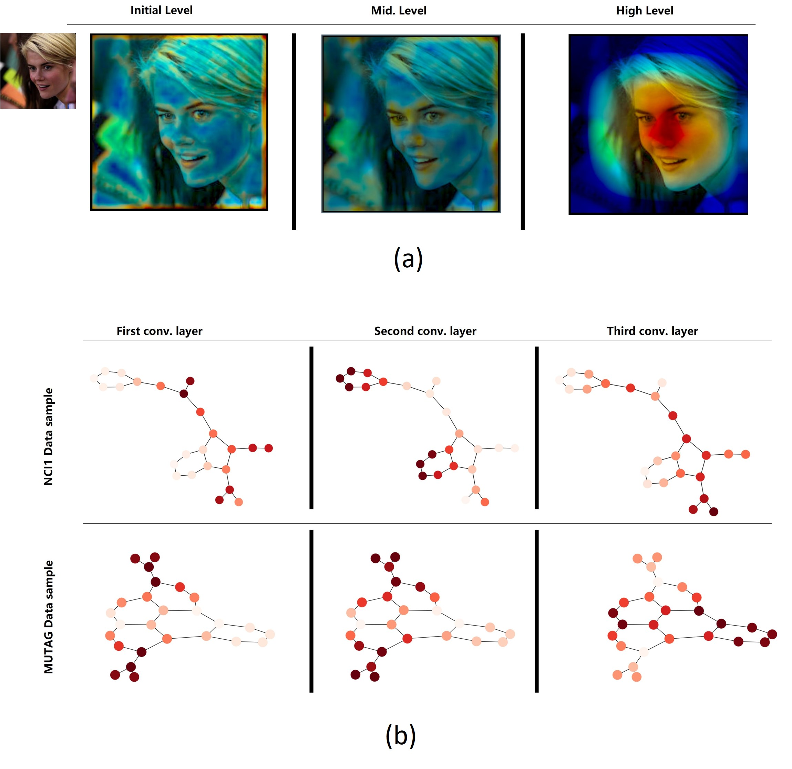
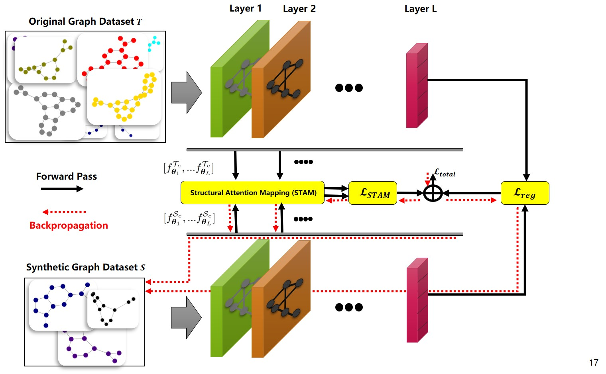

## Official implementation of "GSTAM: Efficient Graph Distillation with Structural Attention-Matching", to be published as a conference paper at ECCV-DD 2024.
- Project Page: !! Comming Soon !!

##Abstract
--
Graph distillation has emerged as a solution for reducing large graph datasets to smaller, more manageable, and informative ones. Existing methods primarily target node classification, involve computationally intensive processes, and fail to capture the true distribution of the full graph dataset. To address these issues, we introduce Graph Distillation with Structural Attention Matching (GSTAM), a novel method for condensing graph classification datasets. GSTAM leverages the attention maps of GNNs to distill structural information from the original dataset into synthetic graphs. The structural attention-matching mechanism exploits the areas of the input graph that GNNs prioritize for classification, effectively distilling such information into the synthetic graphs and improving overall distillation performance. Comprehensive experiments demonstrate GSTAM's superiority over existing methods, achieving 0.45% to 6.5% better performance in extreme condensation ratios, highlighting its potential use in advancing distillation for graph classification tasks.

<p align="center">
  <br>
  <sub><b>(a) The attention maps over different levels of a net-
work trained for face recognition that indicates the focus of the network on the par-
ticular input image . (b) An input graph and its corresponding structural
attention map created using a technique similar to Grad-CAM can reveal where
different layers of a trained GNN focus to classify the given graph. This information is
valuable when distilling a graph dataset, as it highlights the areas of the input graph
that the GNN prioritizes for classification.</b></sub>
</p>

<p align="center">
  <br>
  <sub><b>GSTAM matches the structural attention maps of different
layers of a GNN model trained on the full and the synthetic graph dataset, respectively
along with the reg loss to account for the final layer of the GNN model.</b></sub>
</p>
## Requirements
All experiments are performed under `python=3.8.8`

Please see [requirements.txt].
```
numpy==1.20.1
ogb==1.3.0
pandas==1.2.3
scikit_learn==1.1.1
scipy==1.6.2
torch==1.8.1
torch_geometric==2.0.1
tqdm==4.60.0
```

## File Tree

This folder contains all neccesary code files and supplemental material for the main paper.

├── main_attention.py # Source Code for reproducing GSTAM results on behncmark datasets and IPCs

├── scripts   # The folder that contains shell files for reproducibility for each dataset

├── graph_agent_attention_matching.py   # The training and testing functions are defined here

├── requirements.txt   # Lists all related Python packages neccessary for reproducing our model results

└── README.md

## Run the code
Use the following code to run the experiment 
```
dataset=MUTAG; lr_adj=0.1; lr_feat=0.005; lr_dist=0.2 ; attention_power=2; python main_attention.py --attention_power ${attention_power} --lr_dist=${lr_dist} --dataset ${dataset} --init real  --gpu_id=${gpu_id} --nconvs=3 --dis=mse --lr_adj=${lr_adj} --lr_feat=${lr_feat} --epochs=1000 --eval_init=1  --net_norm=none --pool=mean --seed=0 --ipc=1 --save=0```

```
The hyper-parameter settings are listed in [`scripts\script_attention[dataset]`]. Run the following command to get the results.

```
bash script_attention_MUTAG.sh
bash script_attention_DD.sh
bash script_attention_NCI1.sh
bash script_attention_hiv.sh
bash script_attention_bbp.sh
```
By specifying ```save=1```, we can save the condensed graphs.


This Github repository is inspired by https://github.com/amazon-science/doscond

## Cite
```
Comming soon
```


